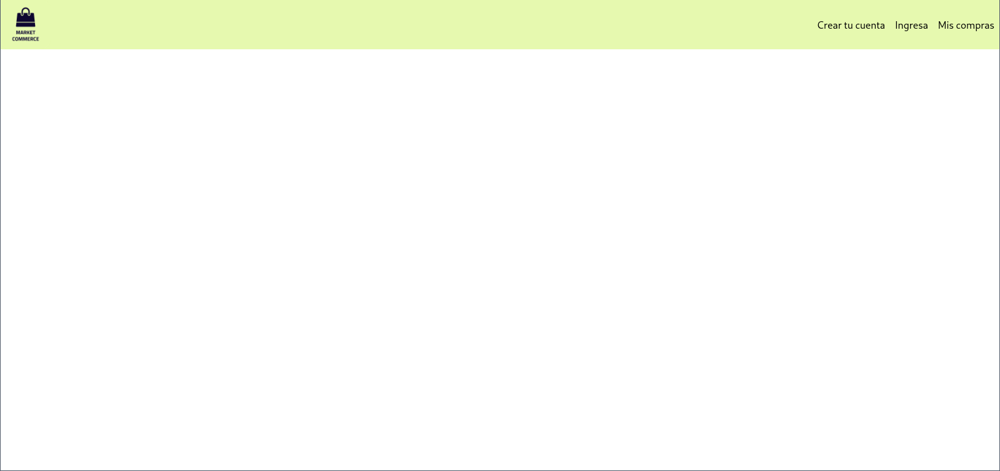
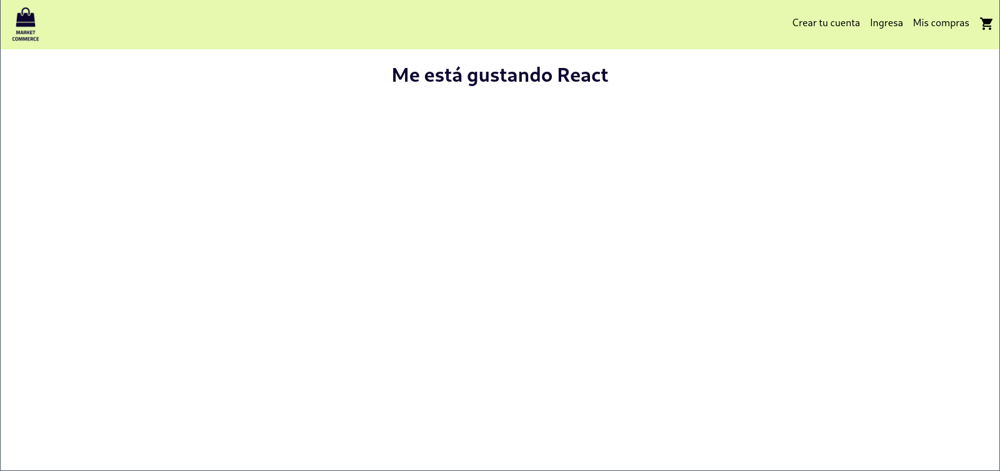
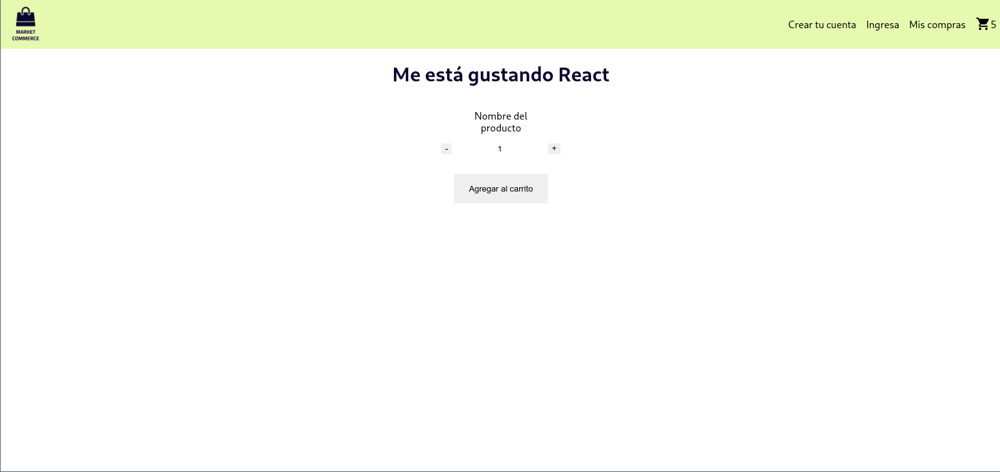
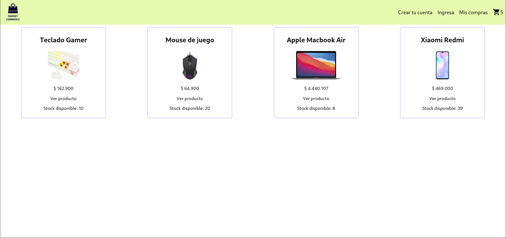
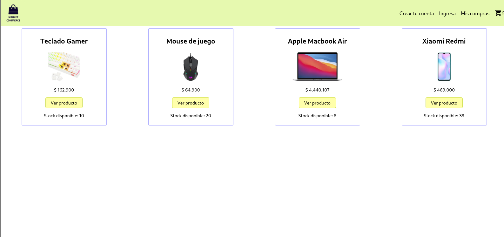
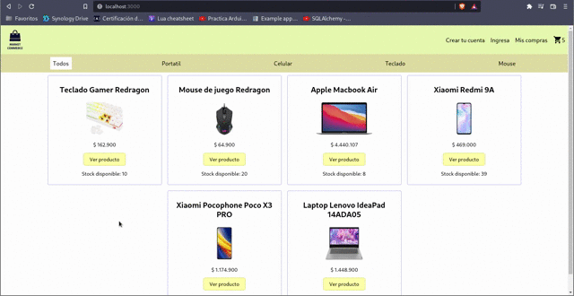
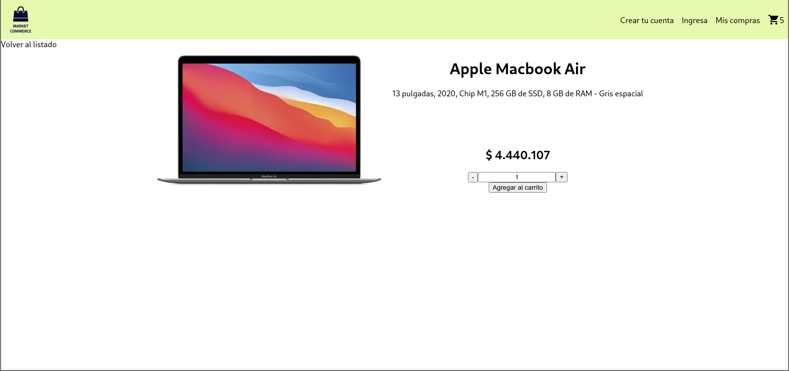

# Ecommerce in React course | CoderHouse

## Add NavBar

## Add shop cart icon and Item list container

## Add Item Count

## Add Item and Item list component

## Add Item Detail

## Add Routes and categories

## Sync Count

