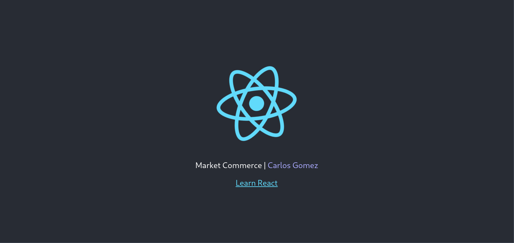
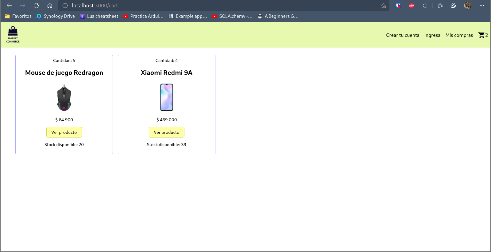
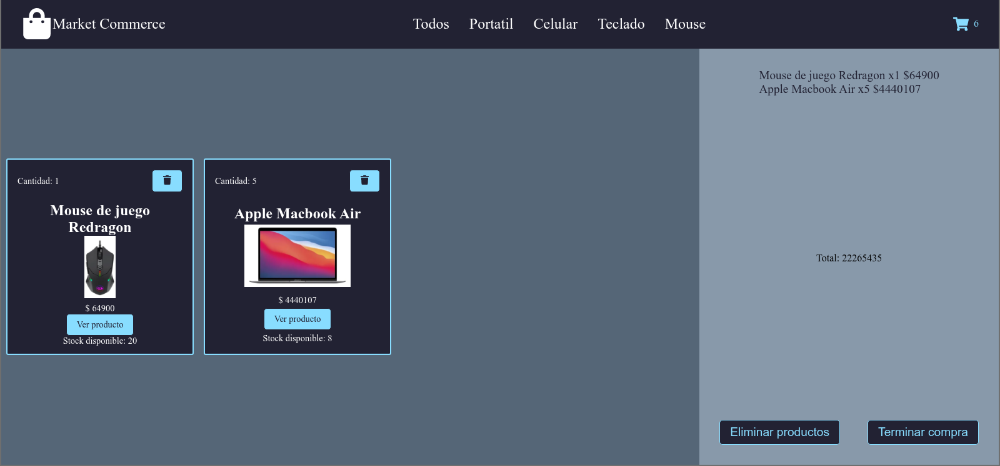
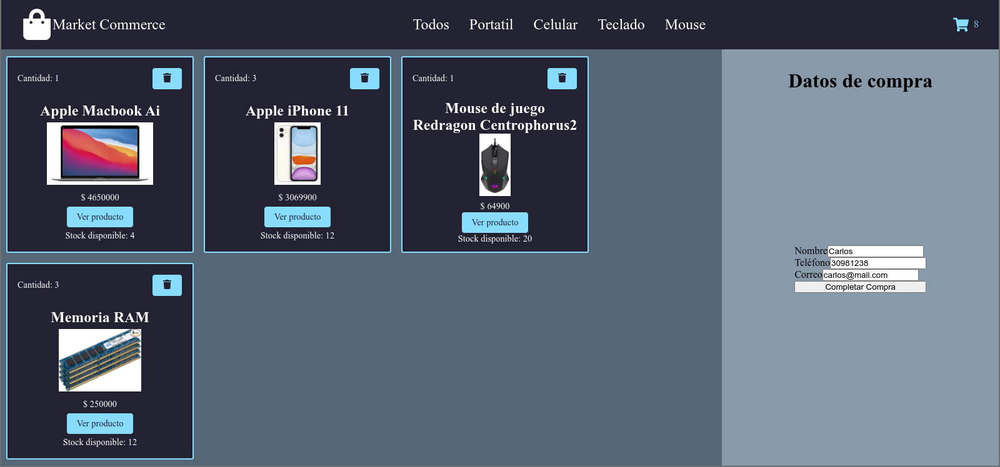
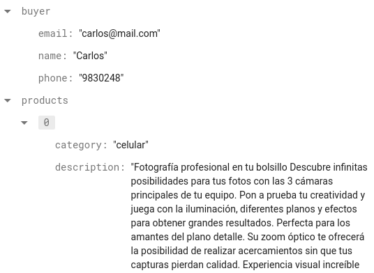

# Ecommerce in React course | CoderHouse

<<<<<<< HEAD

=======
## Add Header

## Add shop cart icon and Item list container

## Add Item Count

## Add Item and Item list component

## Add Item Detail

## Add Router and categories

## Sync Count

## Cart Container with Context

## Cart View

## Order

>>>>>>> order
